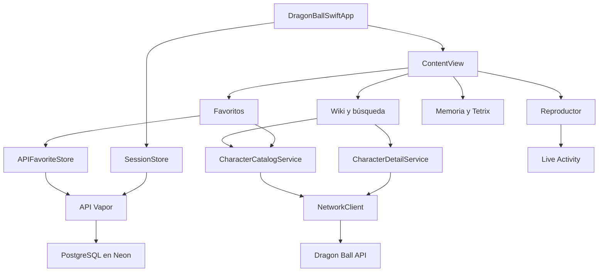

# Arquitectura

La app usa SwiftUI para la presentación, Observation para la mayor parte del estado y Combine para el reproductor y el temporizador de Tetrix. Los modelos que publican estado de interfaz se aíslan en `MainActor`.

## Catálogo y detalles

`CharacterCatalogProviding` permite sustituir el servicio en las pruebas. `CharacterCatalogService`, en `Service/AllCheracteersService.swift`, recorre las páginas de `/api/characters` y elimina IDs repetidos entre ellas. `NetworkClient` valida HTTP y decodifica el JSON; la cancelación se propaga sin convertirla en un error de conexión.

`CharactersViewModel` aplica filtros locales sobre raza y afiliación. La vista inicia la descarga en `.task`, no en el constructor. La búsqueda se calcula sobre los datos actuales, por lo que responde también cuando termina una carga iniciada antes de escribir el texto.

La respuesta del listado (`Character`) y la del detalle (`SingleCharacter`) se adaptan a `CharactersModel`. El listado no contiene planeta ni transformaciones: esos datos se solicitan al abrir la ficha. No se usa la afiliación como sustituto del planeta ni se inventa una biografía.

Kingfisher carga las imágenes de las tarjetas y fichas. La identidad de un personaje es el ID de la API actual. Los favoritos creados con otra API necesitan una migración explícita si sus IDs no coinciden.

## Sesión y favoritos

`SessionStore.shared` restaura las credenciales desde Keychain y verifica `/v1/me`. Google Sign-In obtiene el ID token y Vapor verifica su firma, emisor, audiencia y caducidad. Después emite una sesión aleatoria de siete días, almacenada como hash en PostgreSQL. Cerrar sesión la revoca en el servidor antes de borrar las credenciales locales; si falla la red, la interfaz permite reintentar.

`FavoritesViewModel` depende de `FavoriteCharacterStoring`; `APIFavoriteStore` implementa las consultas HTTPS al backend. `BackendClient` invalida únicamente la sesión cuyo token recibió un 401, evitando que una respuesta antigua cierre una cuenta nueva. Los favoritos se guardan en una tabla con clave única de usuario y personaje. Las consultas derivan el usuario de la sesión verificada.

El modelo publica altas y bajas después de confirmar la escritura. Mantiene una revisión de sesión y verifica el usuario antes de publicar respuestas asíncronas; una respuesta del usuario anterior no debe aparecer en la cuenta nueva. Las tarjetas consultan ese estado compartido, sin guardar copias independientes de los favoritos.

## Audio y Live Activity

`SongResource` resuelve URLs de archivos locales de forma opcional. `SongsPlayerViewModel` es la fuente de verdad para canción, progreso y reproducción. La lista conserva su instancia con `StateObject`. Las actualizaciones del progreso se cancelan al pausar, detener o sustituir la reproducción.

El modelo publica una Live Activity cuando iOS lo permite. La extensión recibe `AudioPlayerAttributesModel`, compartido con el target principal. Muestra canción y progreso calculado a partir de la fecha de inicio; no crea otro reproductor ni comparte objetos de memoria con la app. Es de solo lectura. Los controles desde la isla requerirían App Intents y se consideran una ampliación.

La reproducción se detiene al salir de la ficha del reproductor. No se ha implementado reproducción en segundo plano ni integración completa con Now Playing.

## Juegos

Memoria mantiene el tablero en su modelo. Bloquea una tercera selección durante la resolución de una pareja y cancela tareas pendientes al reiniciar o suspender la pantalla. El primer nivel no limita intentos; a partir de dos rondas se permiten diez fallos y a partir de cuatro se añade un límite de sesenta segundos. Las rondas siguientes conservan la puntuación; Reiniciar empieza de cero.

Tetrix permite piezas parcialmente fuera del tablero mientras entran, pero nunca escribe índices negativos al fijarlas. Sus controles respetan pausa y fin de partida. Las suscripciones del temporizador no retienen el modelo y se cancelan al cerrar la pantalla.

## Límites actuales

No hay repositorio compartido de catálogo con persistencia offline: cada carga puede consultar la API. Persisten implementaciones antiguas fuera del flujo principal, modelos de menú con `AnyView` y nombres históricos de archivos. La interfaz necesita validación en tamaños de texto grandes, iPad y VoiceOver. Estos puntos no deben confundirse con funcionalidades terminadas.
